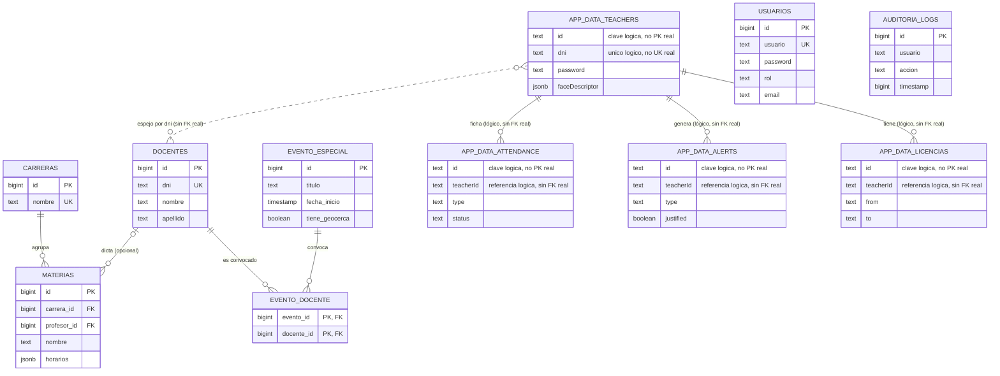

# Base de datos de ASISCAM PRO

Documentación de la base de datos del Sistema de Control de Asistencia
Docente (ASISCAM PRO), preparada para la materia Base de Datos.

**Contenido de esta carpeta:**

| Archivo | Contenido |
|---|---|
| `README.md` | Este archivo: modelo E-R, listado de tablas y su propósito. |
| `schema.sql` | DDL completo y ordenado para recrear la base desde cero. |
| `diccionario_de_datos.md` | Tabla \| columna \| tipo \| nulo \| default \| descripción, de todo el esquema. |
| `consultas_ejemplo.sql` | 5 consultas SQL clave del sistema, comentadas. |
| `decisiones_de_diseño.md` | Justificación de las decisiones de diseño no obvias. |

## Metodología de este relevamiento

Esta documentación **no sale de una introspección en vivo de la base**
(no hubo acceso al panel de Supabase durante la sesión en que se
escribió). Sale de dos fuentes cruzadas, ambas dentro de este mismo
repositorio, para no inventar ninguna columna ni tabla:

1. Las migraciones SQL versionadas en la raíz del proyecto
   (`supabase_schema.sql`, `usuarios_schema.sql`, `add_tabla_materias.sql`,
   `add_horarios_por_dia_materias.sql`, `add_geocerca_evento.sql`,
   `add_tabla_auditoria_logs.sql`, `add_secretaria_rector_usuarios.sql`,
   `fix_rls_eventos.sql`, `fix_cascade_delete.sql`, `fix_unique_evento.sql`,
   `migrate_kclnaabvcxdovvgblyoc_schema.sql`), leídas **en orden
   cronológico** para reconstruir el estado final de cada tabla (varias
   se crean en un archivo y se alteran en otro posterior).
2. El código real (`script.js`, `auditoria.js`): cada llamada
   `sb.from('tabla')` y cada campo leído/escrito ahí es la confirmación
   final de qué existe y se usa hoy, por si una migración quedó
   desactualizada respecto al código (pasó al menos una vez: un
   comentario viejo en `script.js` hablaba de una tabla `docente` que
   ya había sido renombrada a `docentes` en una migración posterior).

Dos tablas quedan **fuera** de `schema.sql` a propósito:
`supabase-schema.sql` (en la raíz del repo, no confundir con
`supabase_schema.sql`) define `escuelas`, una versión distinta de
`docentes`, `asistencias` y `suscripciones` — pero trae en su propio
encabezado la advertencia *"esto todavía NO está conectado a la
app"*: es el diseño reservado para una futura versión multi-escuela
con suscripción paga, nunca cableado al código. Se documentan acá como
antecedente, no como parte del esquema operativo.

## Arquitectura de datos: dos capas

ASISCAM PRO no tiene un único modelo relacional homogéneo. Combina
**dos capas** de almacenamiento sobre la misma base Postgres
(Supabase), y entenderlas por separado es la clave para leer el resto
de esta documentación:

### Capa A — Tablas relacionales

7 tablas con PK/FK convencionales: `usuarios`, `carreras`, `docentes`,
`materias`, `evento_especial`, `evento_docente`, `auditoria_logs`.
Nacieron para las funcionalidades que se agregaron **después** del
sistema original (gestión de Materias, Eventos Especiales, login de
Secretaría/Rector, auditoría multi-dispositivo), y siguen un diseño
relacional normal (ver `decisiones_de_diseño.md`, sección 3).

### Capa B — `app_data` (clave/valor)

Una sola tabla, `app_data(key, value jsonb)`, donde cada fila es una
colección completa (`teachers`, `attendance`, `alerts`, `licencias`,
`criteria`, `geofence`, `modoPrueba`, `kioskPrincipal`, `kioskCodes`).
Es el diseño **original** del sistema (reemplazó a `localStorage`
cuando pasó a tener un backend) y sigue siendo, hoy, la fuente de
verdad de los docentes, los fichajes, las alertas y toda la
configuración operativa — ver `decisiones_de_diseño.md`, sección 1,
para el porqué.

**Puente entre las dos capas:** no hay una FK real entre ellas
(Postgres no puede referenciar un elemento dentro de un array jsonb).
El puente es la tabla `docentes` (Capa A), un espejo minimalista de
`app_data.teachers` sincronizado por `dni` cada vez que un docente se
asigna a una materia o se convoca a un evento — existe únicamente para
que `materias.profesor_id` y `evento_docente.docente_id` tengan una
fila real a la cual apuntar.

## Dónde está cada cosa que pediste documentar

Para ubicarse rápido si venís buscando los nombres típicos de un
sistema de asistencia:

| Buscás... | Está en... |
|---|---|
| **docentes** (perfil de login, foto, biometría, contacto) | `app_data` (`key='teachers'`) — la fuente real. `docentes` (tabla) es solo el espejo relacional para las FK de Materias/Eventos. |
| **asistencia** (fichajes) | `app_data` (`key='attendance'`) — no existe una tabla `asistencia`/`asistencias` conectada (ver "Metodología" más arriba). |
| **profiles / usuarios** | `usuarios` (tabla) — pero ojo: solo los 3 roles de gestión (Secretaría/Rector/Programador). Los docentes NO están en `usuarios`, están en `app_data.teachers`. |
| **app_config** | No existe una tabla con ese nombre. El equivalente es `app_data` (`key='criteria'` para los umbrales, `key='geofence'` para la ubicación de fichaje, etc.) — ver `decisiones_de_diseño.md`, sección 1. |
| **audit_logs** | `auditoria_logs` (tabla) — esta sí existe tal cual, es una tabla relacional normal. |

## Modelo Entidad-Relación

`APP_DATA_TEACHERS`/`APP_DATA_ATTENDANCE`/`APP_DATA_ALERTS`/
`APP_DATA_LICENCIAS` no son 4 tablas: son las 4 colecciones más
grandes dentro de la única tabla `app_data`, dibujadas por separado
acá solo para que el diagrama muestre sus relaciones lógicas (todas
por `teacherId`/`id`, en jsonb, sin constraint real de la base). Ver
`schema.sql` para la tabla `app_data` tal cual existe.

## Listado de tablas

### `usuarios`
**Para qué sirve:** login de los 3 roles de gestión (Secretaría,
Rector, Programador) — nunca de docentes.
**PK:** `id` (bigint, identity). **FK:** ninguna.
**Constraints:** `usuario` único; `rol` limitado en la práctica a
`admin`/`secretaria`/`rector` (sin `CHECK` en la base, se valida en
`roles.js`).
**Columnas:** `id`, `usuario`, `password`, `rol`, `email`,
`email_respaldo`, `reset_token`, `reset_token_expira`, `updated_at`.
Detalle completo en `diccionario_de_datos.md`.

### `app_data`
**Para qué sirve:** almacén clave/valor genérico — es la tabla más
importante del sistema en términos de volumen de datos: guarda los
docentes, los fichajes, las alertas, las licencias y toda la
configuración operativa (ver "Arquitectura de datos" más arriba).
**PK:** `key` (text). **FK:** ninguna (es, a propósito, la tabla sin
relaciones formales del esquema).
**Constraints:** ninguno a nivel de columna dentro de `value` (jsonb
libre) — la validación de forma vive en `script.js`.
**Columnas:** `key`, `value` (jsonb), `updated_at`. El contenido de
cada `key` (teachers/attendance/alerts/licencias/criteria/geofence/
modoPrueba/kioskPrincipal/kioskCodes) está detallado campo por campo
en `diccionario_de_datos.md`.

### `carreras`
**Para qué sirve:** carreras/orientaciones del establecimiento (p. ej.
"Bachiller en Informática"), agrupan a las materias.
**PK:** `id`. **FK:** ninguna.
**Constraints:** `nombre` único.
**Columnas:** `id`, `escuela_id`, `nombre`, `created_at`.

### `docentes`
**Para qué sirve:** espejo relacional mínimo de `app_data.teachers`,
para que `materias.profesor_id` y `evento_docente.docente_id` tengan
una fila real a la que apuntar (Postgres no referencia elementos
dentro de un jsonb). Se sincroniza solo, por `dni`, nunca se edita a
mano.
**PK:** `id` (identity, arranca en 500000 para no chocar con ids
históricos migrados a mano). **FK:** ninguna saliente.
**Constraints:** `dni` único (es la clave de sincronización).
**Columnas:** `id`, `escuela_id`, `dni`, `nombre`, `apellido`, `email`,
`telefono`, `password`, `calle`, `numero`, `barrio`, `localidad`,
`provincia`, `pais`, `created_at`.

### `materias`
**Para qué sirve:** grilla de cátedra — qué materia se dicta, en qué
carrera/año/cuatrimestre, con qué horario semanal y a cargo de qué
docente.
**PK:** `id`. **FK:** `carrera_id → carreras.id` (`ON DELETE
RESTRICT`); `profesor_id → docentes.id` (`ON DELETE SET NULL`,
opcional).
**Constraints:** `CHECK` en `anio` (1/2/3), `cuatrimestre` (1/2) y
`tipo` (`ANUAL`/`CUATRIMESTRAL`).
**Columnas:** `id`, `escuela_id`, `carrera_id`, `nombre`, `anio`,
`cuatrimestre`, `tipo`, `dias`, `hora_inicio`, `hora_fin`, `horarios`
(jsonb, fuente real del horario), `profesor_id`, `created_at`.

### `evento_especial`
**Para qué sirve:** actos, capacitaciones u otros eventos puntuales
fuera de la cátedra regular, con fichaje y convocatoria propios.
**PK:** `id`. **FK:** ninguna saliente.
**Constraints:** único por `(titulo, fecha_inicio)`, para frenar altas
duplicadas por doble clic.
**Columnas:** `id`, `escuela_id`, `titulo`, `descripcion`,
`fecha_inicio`, `fecha_fin`, `direccion_evento`, `tiene_geocerca`,
`geocerca_lat`, `geocerca_lng`, `geocerca_radio`, `created_at`.

### `evento_docente`
**Para qué sirve:** tabla puente N:M — qué docentes fueron convocados
a cada evento.
**PK:** compuesta `(evento_id, docente_id)`. **FK:** `evento_id →
evento_especial.id` y `docente_id → docentes.id`, ambas `ON DELETE
CASCADE`.
**Constraints:** ninguno adicional — la PK compuesta ya impide
convocar dos veces al mismo docente al mismo evento.
**Columnas:** `evento_id`, `docente_id`.

### `auditoria_logs`
**Para qué sirve:** registro de auditoría de acciones del sistema
(fichajes, altas/bajas, permisos denegados, cambios de configuración),
visible desde cualquier dispositivo — reemplazó a un log que antes
vivía solo en `localStorage` de cada navegador.
**PK:** `id`. **FK:** ninguna (deliberado: un log de auditoría no debe
poder "romperse" porque se borró el docente al que hace referencia).
**Constraints:** ninguno más allá de `NOT NULL` en los campos
esenciales (`fecha`, `timestamp`, `accion`).
**Columnas:** `id`, `fecha`, `timestamp`, `usuario`, `rol`, `accion`,
`detalle`, `dispositivo`, `plataforma`, `ubicacion` (jsonb),
`created_at`.

---

Para el detalle campo por campo de las 7 tablas relacionales **y**
del contenido de cada `key` de `app_data`, ver
[`diccionario_de_datos.md`](./diccionario_de_datos.md). Para el
razonamiento detrás de cada decisión no obvia (por qué `app_data` es
clave/valor, por qué se sacó el campo de tardanza duplicado, análisis
de normalización y la elección Supabase + Firebase Hosting), ver
[`decisiones_de_diseño.md`](./decisiones_de_diseño.md).
